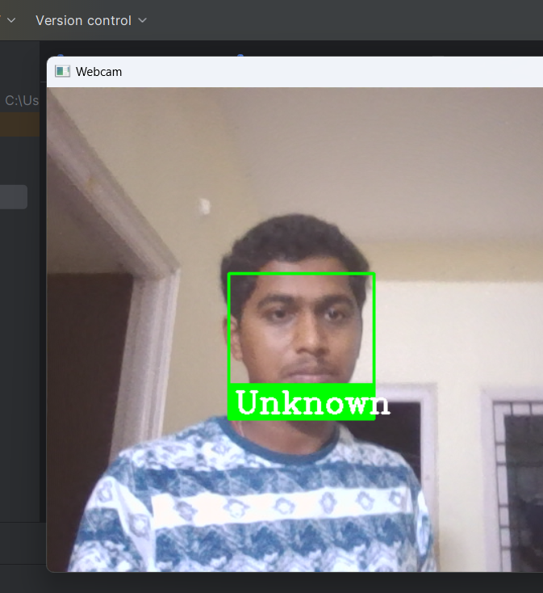

# Face Recognition Attendance System

The Face Recognition Attendance System is a Python application that automates attendance tracking using computer vision and machine learning. It captures video via webcam, detects and recognizes faces by comparing them to a pre-trained dataset, and logs the recognized person's name and timestamp in a CSV file.

## Features

- Real-time face detection and recognition
- Automated attendance logging
- Duplicate prevention to ensure each person is recorded once per session
- Attendance data stored in a CSV file for easy management

## How It Works

1. **Image Recognition:**

   
   
   
   
  

3. **Attendance Sheet**
   
   

 5. **Unknown Face**
    
   


## Installation

1. Clone the repository:
    ```bash
    git clone https://github.com/sayyadameer/face-recognition-attendance-system.git
    ```

2. Navigate to the project directory:
    ```bash
    cd face-recognition-attendance-system
    ```

## Usage

1. Place images of the individuals in the `ImagesAttendance` folder.
2. Run the Python script:
    ```bash
    python attendance_system.py
    ```
3. The application will start capturing video from your webcam. Press 'q' to exit.

## Contributing

Feel free to submit issues or pull requests for improvements.

## License

This project is licensed under the MIT License - see the [LICENSE](LICENSE) file for details.
